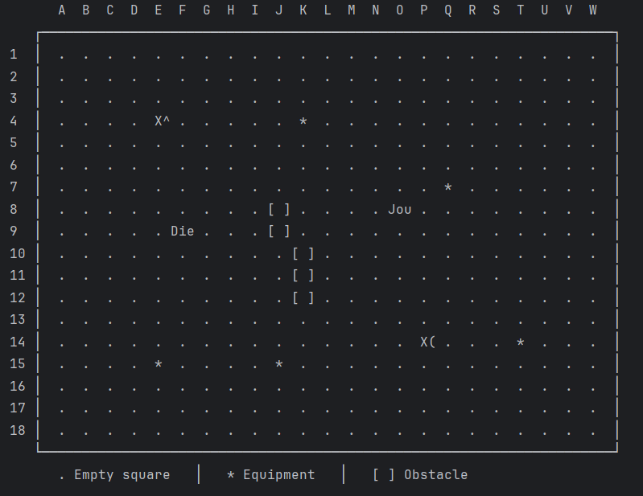
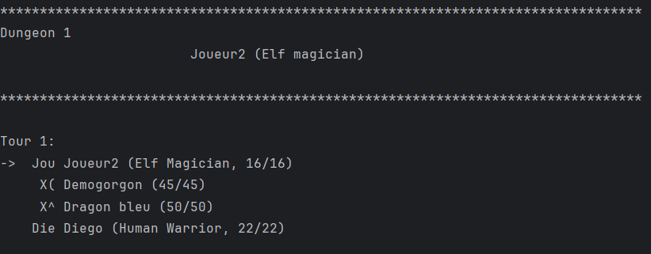
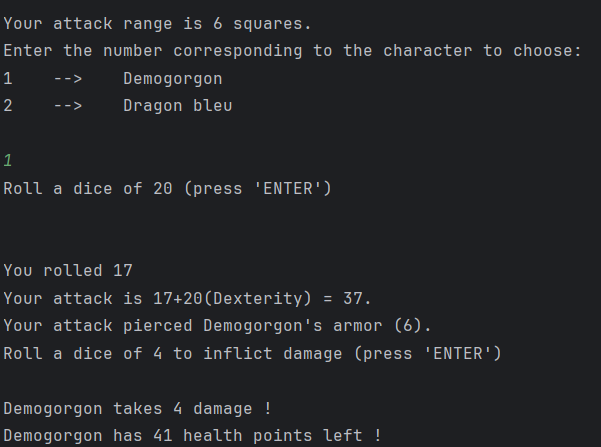

# DOOnjons et Dragons 

Projet de fin de 1ère année de **BUT Informatique** à l’**IUT d’Illkirch**.

Le but de ce projet était de développer un **jeu Donjons & Dragons sur le terminal**.  
Le jeu permet la création de donjons, de personnages et d'équipements.


## Captures d'écran

### Affichage du donjon


### Gestion du tour


### Attaque



## Technologies utilisées

- **Langage :** Java   
- **IDE :** IntelliJ IDEA


## Équipe

- Nombre de développeurs : **2**  
- Durée du projet : **5 semaines**


## Installation et exécution

1. **Cloner le dépôt :**
    ```bash
    git clone https://github.com/mon-utilisateur/doonjons-et-dragons.git
    cd doonjons-et-dragons/out/production/DOOnjons_et_Dragons
2. Installer une version de Java supérieure à 23:
    [Java Archive Downloads](https://www.oracle.com/java/technologies/javase/jdk23-archive-downloads.html)

3. Lancer le jeu :
    ```bash
    java Main


## Fonctionnalités principales

- Choix de la langue du jeu
- Génération d'un donjon et des joueurs
- Gestion des tours
- Déplacements, attaques, sorts, équipements
- Interventions du maître du jeu
